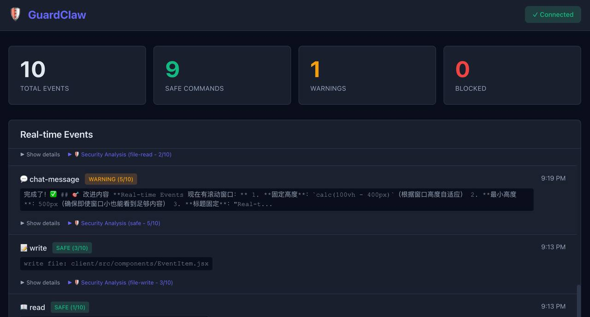

# GuardClaw 🛡️🐾

## Local LLM-Powered Generative Safety for AI Agents

GuardClaw brings **generative AI safety analysis** to your AI agents using
**local LLMs** (LM Studio, Ollama). Every command, file operation, and chat
message is analyzed by a local language model that understands context,
intent, and risk—**without sending any data to the cloud**.

## 🌟 Core Feature: Generative Safety Powered by LM Studio

Unlike traditional rule-based security tools, GuardClaw uses **LM Studio** to
run local language models that provide intelligent, context-aware safety
analysis:

- 🧠 **Context-Aware Analysis** - Understands the full context of commands,
  not just pattern matching
- 🔒 **100% Local via LM Studio** - All analysis runs on your machine through
  LM Studio's local inference server
- 🎯 **Intent Understanding** - Distinguishes between `echo "password=test"`
  (safe) and actual credential leaks
- 📊 **Risk Scoring 0-10** - Nuanced risk assessment with detailed reasoning
  from your local LLM
- 💬 **Natural Language Explanations** - Every decision comes with
  human-readable reasoning
- ⚡ **Real-time Protection** - Analyzes exec commands, file operations, and
  chat messages as they happen

### Why LM Studio + Local LLMs?

- ✅ **Zero Cloud Costs** - No API fees, runs completely offline
- ✅ **Complete Privacy** - Your commands and data never leave your machine
- ✅ **Model Flexibility** - Use any GGUF model (Llama, Mistral, Qwen, etc.)
- ✅ **Fast Inference** - No network latency, instant analysis
- ✅ **Easy Setup** - Download LM Studio, load a model, done!

### Recommended Models for LM Studio

- `llama-3.1-8b` - Fast and accurate for most use cases
- `mistral-7b` - Excellent reasoning capabilities
- `qwen-2.5-7b` - Strong multilingual support
- `openai/gpt-oss-20b` - Balanced performance and quality

## What GuardClaw Does

- 📊 **Real-time Monitoring** - Live event stream of all agent activities
- 🛡️ **Generative Safety Analysis** - Every action analyzed by your local LLM
- 🔍 **Detailed Insights** - Risk scores, categories, and reasoning for each
  event
- 📝 **Complete Audit Trail** - Full execution history with security
  annotations

## Screenshot



**Dashboard Features:**
- 📊 **Real-time Stats** - Days protected, total events, safe commands, warnings, and blocked operations
- 🌓 **Light/Dark Mode** - Toggle between themes with one click
- 🔗 **Connection Status** - Click Gateway/LLM badges to view detailed connection info
- 📋 **Live Event Stream** - Security analysis with risk scores and reasoning
- 🔍 **Expandable Details** - Click events to see full command analysis

## Prerequisites ⚠️

Before installing GuardClaw, you need:

### 1. **LM Studio** (Required for local AI analysis)

Download and install [LM Studio](https://lmstudio.ai):
- **macOS/Windows/Linux** - Free download from lmstudio.ai
- Load a model (recommended: `mistral-7b-instruct`, `llama-3.1-8b`, or `qwen-2.5-7b`)
- Start the local server (default: `http://localhost:1234`)

**Why?** GuardClaw uses LM Studio's local LLM to analyze command safety with zero cloud costs and complete privacy.

### 2. **Clawdbot Gateway** (Required for monitoring)

Install [Clawdbot](https://github.com/clawdbot/clawdbot):
```bash
npm install -g clawdbot@latest
clawdbot gateway start
```

### 3. **Node.js ≥18** (Required runtime)

Check your version: `node --version`

---

## Quick Start (TL;DR)

**Step 1**: Start LM Studio server (http://localhost:1234)

**Step 2**: Install and start GuardClaw
```bash
npm install -g guardclaw@latest
guardclaw start
```

**Step 3**: Open browser → `http://localhost:3001`

That's it! GuardClaw will connect to your local Clawdbot Gateway at
`ws://127.0.0.1:18789` and analyze commands via LM Studio.

## Installation

### Global Install (Recommended)

```bash
npm install -g guardclaw@latest
```

### Update to Latest Version

```bash
guardclaw update
```

Or manually:
```bash
npm update -g guardclaw
```

### From Source

```bash
git clone https://github.com/TobyGE/GuardClaw.git
cd GuardClaw
npm install
npm install --prefix client
npm run build
npm link
```

## Configuration

GuardClaw works out of the box with sensible defaults. For custom
configuration:

### Option 1: Environment variables

```bash
export CLAWDBOT_URL=ws://127.0.0.1:18789
export CLAWDBOT_TOKEN=your_token_here
export ANTHROPIC_API_KEY=your_claude_key_here
export PORT=3001
```

### Option 2: .env file

Create `.env` in your current directory:

```env
CLAWDBOT_URL=ws://127.0.0.1:18789
CLAWDBOT_TOKEN=your_token_here
ANTHROPIC_API_KEY=your_claude_key_here
PORT=3001
```

### Option 3: Command-line flags

```bash
guardclaw start --port 3002 --clawdbot-url ws://192.168.1.100:18789
```

## Usage

```bash
# Start GuardClaw server
guardclaw start

# Start on custom port
guardclaw start --port 3002

# Connect to remote Clawdbot Gateway
guardclaw start --clawdbot-url ws://192.168.1.100:18789 --clawdbot-token your_token

# Show help
guardclaw help

# Show version
guardclaw version
```

Once running, open `http://localhost:3001` in your browser to access the
monitoring dashboard.

## Features

### 1. Enhanced Trace Viewer

- Real-time visualization of all agent activities
- Detailed breakdown of tool calls (exec, Read, Write, API calls)
- Nested execution context (parent-child relationships)
- Timeline view with filtering

### 2. LLM-based Safeguard

Every command is analyzed by an LLM before execution:

- **Risk Score (0-10)**: Automatic risk assessment
- **Safety Categories**: File operations, network, system changes
- **Auto-block**: Prevents dangerous operations (rm -rf /, shutdown, etc.)
- **Smart approval**: User confirmation for medium-risk operations

### 3. Safety Levels

- 🟢 **Safe (0-3)**: Execute immediately
- 🟡 **Warning (4-7)**: Show warning, require acknowledgment
- 🔴 **Dangerous (8-10)**: Require explicit confirmation with details

## Architecture

```text
┌─────────────┐
│  Clawdbot   │
│   Gateway   │
└──────┬──────┘
       │ WebSocket
       ▼
┌─────────────┐      ┌──────────────┐
│  GuardClaw  │◄────►│ LM Studio    │
│   Server    │      │ (Local LLM)  │
└──────┬──────┘      └──────────────┘
       │ HTTP/WS
       ▼
┌─────────────┐
│  Web UI     │
│  (React)    │
└─────────────┘
```

## Safety Examples

### Safe command

```bash
ls -la ~/documents
```

Risk: 2/10 - Read-only directory listing ✅

### Warning command

```bash
rm important-file.txt
```

Risk: 6/10 - File deletion, requires confirmation ⚠️

### Dangerous command

```bash
rm -rf /
```

Risk: 10/10 - BLOCKED automatically 🚫

## Development

```bash
npm run dev       # Development mode with hot reload
npm run build     # Production build
npm test          # Run tests
```

## Tech Stack

- **Backend**: Node.js + Express + WebSocket
- **Frontend**: React + Vite + ReactFlow
- **AI Safety**: LM Studio (local LLM inference)
- **Real-time**: Server-Sent Events (SSE)

## License

GuardClaw is available under a **Dual License**:

- **FREE** for personal, educational, research, and open-source use
- **PAID commercial license** required for business/commercial use

See [LICENSE](LICENSE) file for full details.

**Commercial use?** Contact via [GitHub Issues](https://github.com/TobyGE/GuardClaw/issues)

## Credits

Inspired by [OpenClaw](https://github.com/openclaw/openclaw)
