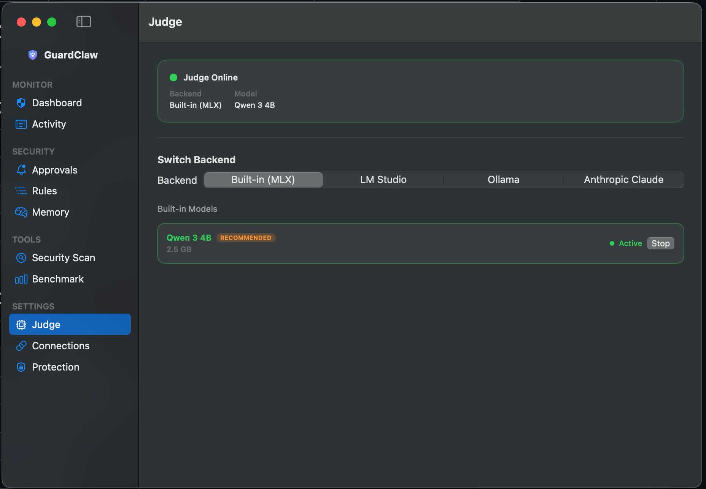

<p align="center">
  <h1 align="center">
    
    GuardClaw
  </h1>
  <p align="center">
    <strong>Smart permission layer for AI agents, powered by local LLMs</strong>
  </p>
  <p align="center">
    100% local. Zero cloud. Real-time risk judgment for agent tool calls.
  </p>
</p>

<p align="center">
  <a href="https://github.com/TobyGE/GuardClaw/blob/main/LICENSE">
    
  </a>
  <a href="https://github.com/TobyGE/GuardClaw/actions/workflows/lint.yml">
    
  </a>
  <a href="https://github.com/TobyGE/GuardClaw/actions/workflows/deploy-pages.yml">
    
  </a>
</p>

<p align="center">
  <a href="#the-problem">The Problem</a> ·
  <a href="#quick-start">Quick Start</a> ·
  <a href="#how-it-works">How It Works</a> ·
  <a href="#product-tour">Product Tour</a> ·
  <a href="docs/GUARDCLAWBAR.md">Menu Bar App</a> ·
  <a href="docs/ROADMAP.md">Roadmap</a>
</p>

---


## The Problem

AI agents usually fail in one of two ways:

- **Too loose:** dangerous operations run with little control
- **Too strict:** safe operations keep interrupting the user

GuardClaw sits between the agent and tools, scores each action with a local LLM, and makes a practical decision:

- safe actions continue without friction
- suspicious actions are surfaced for approval

## Quick Start

### Prerequisites

- [LM Studio](https://lmstudio.ai) or [Ollama](https://ollama.ai)
- [Claude Code](https://docs.anthropic.com/en/docs/claude-code),
  [OpenClaw](https://github.com/openclaw/openclaw),
  [Gemini CLI](https://github.com/google-gemini/gemini-cli), or
  [nanobot](https://github.com/HKUDS/nanobot)

Recommended model: `qwen/qwen3-4b-2507`

### 1) Install and start GuardClaw

```bash
git clone https://github.com/TobyGE/GuardClaw.git
cd GuardClaw
npm install && npm install --prefix client && npm run build
npm link
guardclaw start
```

### 2) Run onboarding in the dashboard (`localhost:3002`)

Use the built-in onboarding flow to finish setup in order:

1. **Judge**: choose backend (Built-in MLX / LM Studio / Ollama) and activate a model
2. **Connections**: install hooks/plugin for Claude Code, Gemini CLI, or OpenClaw
3. **Security Check**: run initial scan for skills, hooks, MCP servers, and plugin code
4. **Protection**: choose `Strict` (recommended), `Balanced`, or `Monitor`

`Strict` enables fail-closed by default, so risky calls stop if GuardClaw or the local judge is unavailable.

Restart the target client after installing hooks/plugin (Claude Code, Gemini CLI, OpenClaw).

### 3) Verify with a real task

- run a safe command and confirm it is scored and logged
- run a risky command and confirm it is gated based on your protection level


### Optional: Manual CLI setup

If you prefer terminal-only setup:

```bash
# Claude Code hooks
node scripts/install-claude-code.js

# OpenClaw token + plugin
guardclaw config detect-token --save
guardclaw plugin install
openclaw gateway restart
bash scripts/patch-openclaw.sh
```

## How It Works

1. Agent calls a tool (exec, read, write, browser, etc.)
2. GuardClaw captures context and sends it to a local judge model
3. The model returns risk score + verdict + reasoning
4. GuardClaw logs, allows, or gates execution based on policy

### Risk Tiers

| Score | Verdict | Behavior |
| ----- | ------- | -------- |
| 1-3 | SAFE | Runs normally |
| 4-7 | WARNING | Runs with stronger audit signal |
| 8-10 | HIGH RISK | Requires approval / blocking path |

## Product Tour

### Dashboard

The dashboard (`localhost:3002`) is the central control plane:

- event timeline and turn grouping
- risk filters and decision details
- agent/session visibility
- blocking and fail-closed toggles


### Security Scan

Security Scan adds static checks for MCP configuration, secrets exposure, and agentic-risk patterns.


### Judge Settings

Judge settings let you switch local backends and models (including built-in MLX flow) and verify runtime status.



### Menu Bar App (macOS)

[GuardClawBar](docs/GUARDCLAWBAR.md) gives native monitoring and quick actions without keeping a browser tab open.


## Architecture Highlights

- local LLM risk judge with per-model prompt tuning
- context-aware analysis (intent, cwd, tool history, memory)
- chain analysis for multi-step attack detection
- rule-based fast path for obvious safe/dangerous cases
- SQLite persistence with real-time SSE streaming
- multi-platform integrations: Claude Code, OpenClaw, Gemini CLI, nanobot

## CLI Reference

```bash
guardclaw start
guardclaw stop

guardclaw config detect-token --save
guardclaw config set-token <token>

guardclaw plugin install
guardclaw plugin uninstall
guardclaw plugin status

guardclaw status              # server & judge status
guardclaw stats               # event counts and risk breakdown
guardclaw history [n]         # recent events (default 10)
guardclaw model               # active judge model info
guardclaw blocking [on|off]   # view or toggle blocking mode
guardclaw check <command>     # check risk score for a command
guardclaw approvals           # pending approval requests
guardclaw memory              # learned safe/risky patterns

guardclaw help
```

## Links

- [Roadmap](docs/ROADMAP.md)
- [Troubleshooting](docs/LMSTUDIO-TROUBLESHOOTING.md)
- [OpenClaw](https://github.com/openclaw/openclaw)
- [Claude Code](https://docs.anthropic.com/en/docs/claude-code)
- [Gemini CLI](https://github.com/google-gemini/gemini-cli)
- [nanobot](https://github.com/HKUDS/nanobot)

---

<p align="center">
  <sub>Built for practical agent safety. Your data stays on your machine.</sub>
</p>
